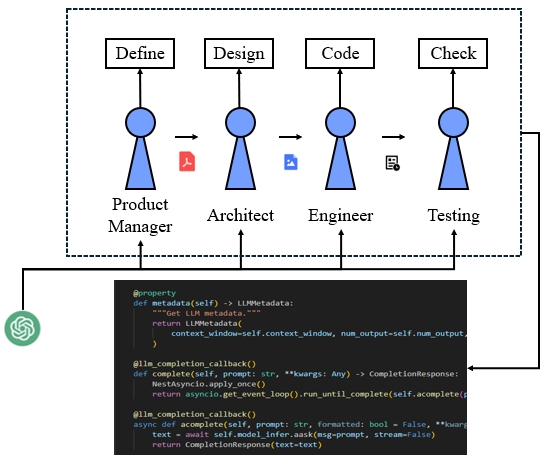

# AlgorithmGPT: Gathering Different Agents to Develop Algorithms to Solve Coding Problems

AlgorithmGPT leverages the power of multi-agent collaboration to tackle complex coding challenges. Inspired by recent advancements in multi-agent systems and large language models (LLMs), our framework utilizes specialized agents, each with distinct roles and expertise, to collaboratively develop and refine algorithms.

Unlike traditional single-agent approaches, AlgorithmGPT employs a structured workflow where agents work in unison, following standardized operating procedures (SOPs). This ensures coherent and efficient problem-solving, minimizing errors and maximizing the quality of the generated solutions. The agents collectively analyze requirements, design solutions, generate code, and perform iterative testing and debugging to produce high-quality, executable code.

Key features of AlgorithmGPT include:
- **Role Specialization**: Agents are assigned specific roles such as Product Manager, Architect, Engineer, and QA Engineer, each contributing their domain expertise.
- **Structured Communication**: Utilizing a publish-subscribe mechanism, agents share and access information efficiently, ensuring smooth collaboration.
- **Executable Feedback**: An iterative feedback mechanism allows agents to refine and optimize code during runtime, enhancing the overall quality and accuracy of the solutions.

AlgorithmGPT represents a significant leap forward in autonomous software development, demonstrating the potential of multi-agent systems in solving complex coding problems with greater efficiency and accuracy.
